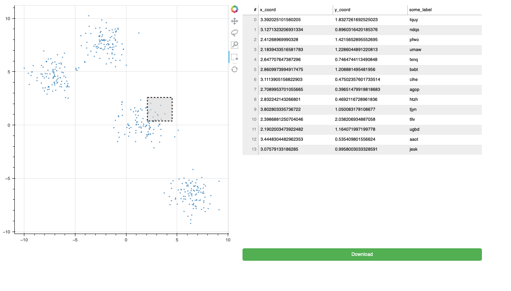

# Bokeh scatter linked to table with download - proof of concept

This repo contains a minimal proof-of-concept for linking a scatterplot selection to a table in Bokeh. It also contains a "Download" button that triggers `download.js` which will save the current table as a CSV file.

To run locally:

```bash
$ cd path/to/repo
$ bokeh serve --show app/
```




## Requirements

Created with `bokeh==2.3.0` and `Python 3.9.2`. Not tested with other versions.
